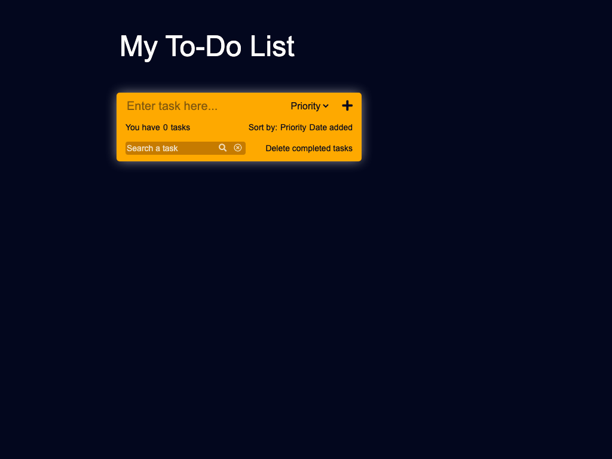
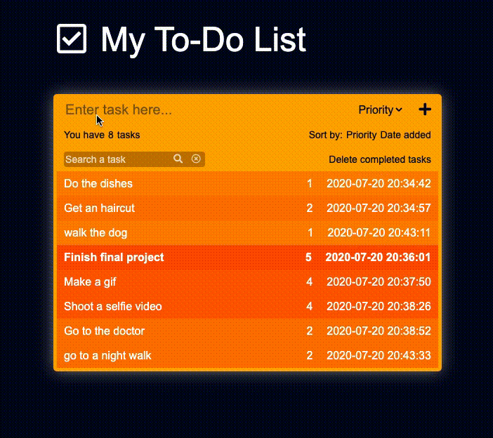

#    Pre Course Project - Todo List

This is my Todo List app!
Hope you will enjoy it

Automated gif:

More functionality gif:

## Links
 - Link to [deployed app]()
 - Link to [video on google drive]()

 ## Features added
 - Delete task.
 - Mark task as done. 
 - Delete all completed task with one button.
 - Sort by task priority or date created.
 - Drag-and-drop tasks in the list.
 - Search functionality.
 - The app is consistant (using LocalStorage).
 - App deployed to the internet (link above).

 - Record a 5 min selfie video, describe yourself in a few words, talk about the project you submit - try to explain how your app works. Think about this video as an interview
 - Upload the 5 min video to the cloud (google drive) and add here (README.md) the public link for the video (can be located under the gif)
 - [Create a Pull Request](https://docs.github.com/en/github/collaborating-with-issues-and-pull-requests/creating-a-pull-request) from the new brunch you created in the Instructions into master in your duplicated repository
 - add Github usernames: GuySerfaty, fainir and tomeryp as [collaborators](https://docs.github.com/en/github/setting-up-and-managing-your-github-user-account/inviting-collaborators-to-a-personal-repository) to your imported repo.
 - Add link to the PR you created in your private repo [here](https://docs.google.com/spreadsheets/d/1P9_YDGqIqmV10fvTmIXc_AGV0_ycI2aBFo2h5zprUMI/edit#gid=1903529310), fill the other details
